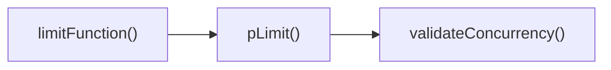
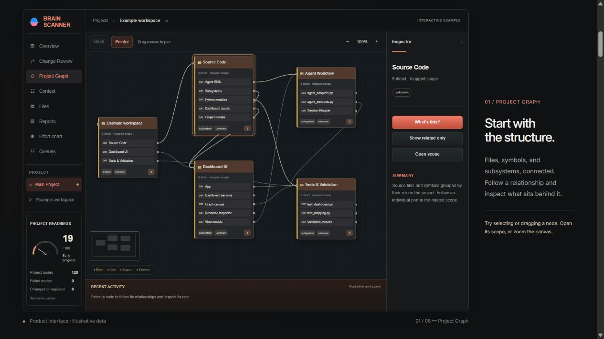

# See the code around your next change

**Brain Scanner gives your coding agent a project map it can look up while it works.** Follow a function to its callers, inspect the connections in the dashboard, and use them to decide what deserves review before the next edit.

**[Try the interactive demo](https://brainscanner.dev/)** · **[Create a free beta account](https://brainscanner.dev/signup)**

## Start with a real example

Suppose you're changing a concurrency validator in **p-limit**. Its saved map shows two entry points to review:

**[Follow the example and its source links →](p-limit-dependency-example.md)**

**[Read the codebase impact-analysis guide in your browser](https://brainscanner.dev/guides/codebase-impact-analysis)**

**[Open the four-page visual guide (PDF)](brain-scanner-before-the-next-edit.pdf)** · [Download the PDF](https://raw.githubusercontent.com/kevin-lozada-santos/brain-scanner-walkthrough/main/brain-scanner-before-the-next-edit.pdf)

A short walkthrough of the caller chain, individual call-site review, the test results, and your first-map steps.

The walkthrough follows these calls into a practical review checklist. Check individual call sites in source: a function-level relationship can represent both an initialization call and a nested setter call. The graph helps locate code to inspect; it does not prove call-site coverage.

## Review the outcome before continuing

**[The unit tests passed. The requested check still failed.](outcome-review-example.md)**

**[Watch the 46-second illustrated walkthrough](https://kevin-lozada-santos.github.io/brain-scanner-walkthrough/)** — video, English captions, transcript, evidence, and free-beta setup links. This is an owner demonstration with synthetic narration, not a screen recording or customer result.

A verified owner demonstration of separate full-command, runtime, and type-check criteria, a downloaded continuation brief, and a canceled outcome that cannot be newly queued. Recorded evidence remains subject to human review.

## Map a small project of your own

Start with a public sample or a project you're permitted to inspect.

1. **[Create your free account](https://brainscanner.dev/signup)** and confirm your email.
2. **[Connect your coding agent](https://brainscanner.dev/connect).** The hosted MCP endpoint is `https://brainscanner.dev/mcp/v2`. Complete the agent's authorization as well as the website sign-in.
3. **Open the project in your agent.** Replace the bracketed text below with one function or file you want to understand:

> Map this project in Brain Scanner, starting with [function or file]. Show its callers and relevant tests, with source references, then open the saved graph. Leave the code unchanged. Save project metadata only; exclude source-file contents, raw diffs, logs and secrets.

4. **Follow one connection in the dashboard.** Check it against the source and use it to choose the next file or test to review.

Your first result should be a saved map you can inspect and a concrete starting point for reviewing your change. Start small; you can explore more of the project from there.

**Stuck on a step?** Tell us your client and where you stopped in the [walkthrough discussion](https://github.com/openai/codex/discussions/44291), or email **support@brainscanner.dev**. Keep private code and credentials out of public replies.

## Explore before connecting

*Screenshot of the interactive demo, with illustrative project data.*

The [no-account demo](https://brainscanner.dev/) lets you select graph nodes, inspect sample session context, and try moving a report item into a demo queue. Demo actions do not send work to an agent.

## About this walkthrough

Kevin Lozada Santos built Brain Scanner. His AI assistant prepared this walkthrough and helps answer setup questions. This repository contains public demo materials; the product implementation is private.

The p-limit example used an existing authorized owner test project. Client support and local project access determine which workflows you can run. Saved maps can miss relationships, and context is recorded through supported workflows. Review important findings against the source before relying on them.

[Privacy](https://brainscanner.dev/privacy) · [Terms](https://brainscanner.dev/terms)

