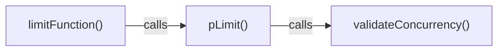

# Before changing a validator, find the callers

**A concrete Brain Scanner exercise for developers using coding agents on an existing codebase.** Start with one question: if a concurrency validator changes, which public entry points deserve review?

This example uses the open-source [p-limit v7.3.2 revision](https://github.com/sindresorhus/p-limit/commit/783068bb9e967fd7bea8642e1bf5a3627fe38bdf). On September 10, 2026, Kevin's authorized AI assistant inspected an existing owner-controlled test map through Brain Scanner's hosted connector in Codex and checked its relationships against that exact source revision. This is a product demonstration, not a customer testimonial or a new-user signup test.

## What the saved graph showed

The saved map contained 43 nodes and 75 relationships. Two recorded call relationships formed this chain:

Both relationships were returned by the hosted tools and displayed in the dashboard. They match the upstream source: `pLimit` invokes the validator during initialization, and `limitFunction` creates its limiter through `pLimit`. [Initialization](https://github.com/sindresorhus/p-limit/blob/783068bb9e967fd7bea8642e1bf5a3627fe38bdf/index.js#L3-L10) · [Wrapper](https://github.com/sindresorhus/p-limit/blob/783068bb9e967fd7bea8642e1bf5a3627fe38bdf/index.js#L117-L125)

The first impact query, for `validateConcurrency`, returned the immediate caller `pLimit`. A second query for `pLimit` exposed the wrapper and related test nodes. Do not assume a single query has enumerated every transitive impact.

## What source review added

The `concurrency` setter also invokes the validator before changing the limit. That call site was visible in the source; the map did not expose a separate setter node. A graph is a navigation aid, not a completeness guarantee. [Setter source](https://github.com/sindresorhus/p-limit/blob/783068bb9e967fd7bea8642e1bf5a3627fe38bdf/index.js#L91-L104)

That gives a concrete review checklist for a proposed validator change:

- Check creation through `pLimit` and through `limitFunction`.
- Check changes to an existing limiter's concurrency.
- Preserve or deliberately revise handling of zero, negative values, fractions, missing values, positive integers, and infinity.
- Inspect the existing invalid-concurrency and concurrency-change tests, then run appropriate tests before accepting a code change.

The existing [invalid-concurrency test](https://github.com/sindresorhus/p-limit/blob/783068bb9e967fd7bea8642e1bf5a3627fe38bdf/test.js#L307-L335) supplies several of those cases. This demonstration inspected source and graph records; it did not modify p-limit or run its test suite.

## Try the same exercise on your project

1. [Create a free beta account](https://brainscanner.dev/signup) and confirm your email.
2. [Connect a compatible coding agent](https://brainscanner.dev/connect). The endpoint is `https://brainscanner.dev/mcp/v2`. Website sign-in and agent authorization are separate steps. For Codex, see the [official MCP setup instructions](https://learn.chatgpt.com/docs/extend/mcp?surface=cli). This demonstration reused an existing authorization; it does not establish a fresh setup time or compatibility with every client.
3. Use the [first-map instructions](README.md#map-a-small-project-of-your-own) for a project you are permitted to inspect. Choose a validator or shared helper and ask:

> Inspect the recorded callers of this function, then inspect the callers of its immediate caller. Compare the relationships with the current source. Identify one affected public behavior, one relevant test, and any missing call sites. Report the saved graph version. Do not change source code.

The useful result is an evidence-backed review checklist before the next agent edit. If you get stuck, [reply in the walkthrough discussion](https://github.com/openai/codex/discussions/44291) with your client and the step you reached, or email support@brainscanner.dev. Keep private source, credentials and OAuth redirect addresses out of public replies.

Brain Scanner's beta is currently free. The sample library belongs to its upstream maintainers; this example does not imply their endorsement. Brain Scanner's implementation is private, and this repository contains public demonstration documentation only.
